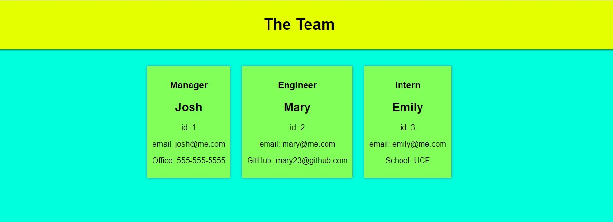
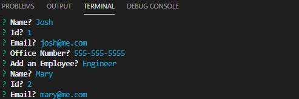

# Team-Building
This app was made so it would be easier for you the build your team and keep track of the team members.

## How it works

Open up node in the terminal. You will then be prompted to answer the questions about what type of employee you will be adding to your team and some information to fill out based on your selection. You can choose from Manager, Engineer and Intern. After you choose your team, you will select finish. Once finish is selected, the app will generate an html page based on your selection and answers. You will find the html file in the dist folder.

## Visuals

